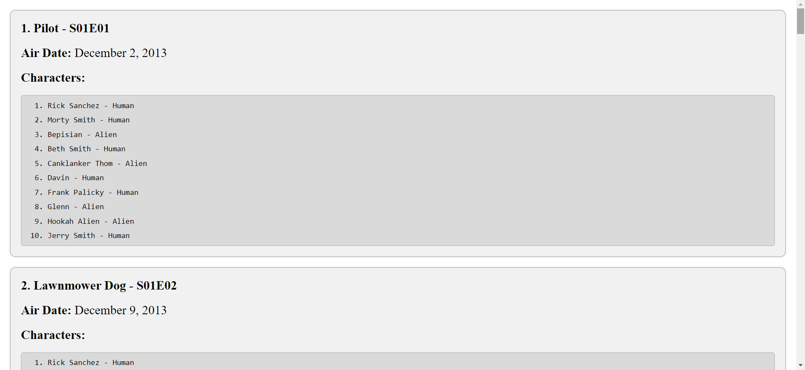

# Parallel requests exercise

## Overview ✍️

The exercise consists of making multiple requests to an API and managing the responses obtained to render the desired information on the screen. In this case, the request is made to the Rick and Morty API to obtain the first 20 episodes, and from these, extract only the first 10 characters

### Installation :gear:

To get started with the project, follow these steps:

1. Clone the repository:

```shell
git clone https://github.com/Cristianjs93/parallel-requests
```

2. Navigate to the project directory:

```shell
cd parallel-requests
```

3. Install the dependencies:

```shell
 npm install
```

4. Start the application:

```shell
 npm run dev
```

### Screenshot 📷



### Built with 🛠️

- React: JavaScript library for building interactive user interfaces.
- CSS: style creator.

## Author 👊

This project was created by [Cristianjs93](https://github.com/Cristianjs93)

<br/>
<br/>

**Reach Further!** 🚀
